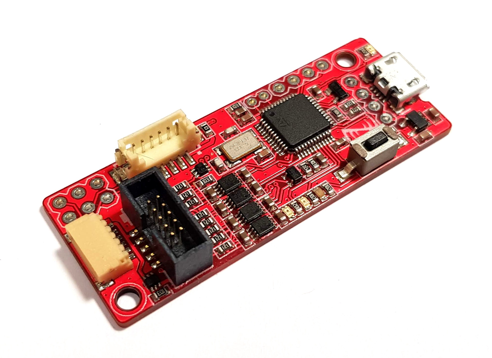
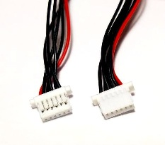
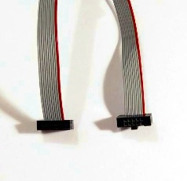
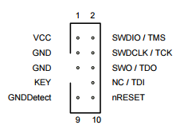

# Droneсode Probe

Dronecode Probe is a generic JTAG/SWD+UART console adapter compatible with most ARM Cortex based designs and in particular with the hardware maintained by the [Dronecode project](http://dronecode.org/).

The design is based on Black Magic Probe and is distributed under open source licenses. The full description of its features and supported targets can be found at the [Black Magic Probe homepage](https://black-magic.org/).

For the manufacturing instructions refer to [MANUFACTURING.md](MANUFACTURING.md).

## Features

- Some of the supported targets include:
  - STMicroelectronics STM32
  - Microchip/Atmel SAM
  - NXP LPC/Kinetis
  - Texas Instruments LM/TM
  - Silicon Labs EFM32/EZR32
  - Xilinx Zynq-7000
  - Broadcom BCM2836
  - **And many others!** See the [Black Magic Probe homepage](https://black-magic.org/) for the full list of supported targets.

- Embedded GDB server on the device. No host-side driver needed (this is unlike, for example, OpenOCD).
  - Loading the application into flash or RAM.
  - Real-time execution and single-stepping.
  - Hardware assisted breakpoints and read/write/access watchpoints.
  - Software breakpoints when executing from RAM.

- Simple integration with development tools and IDE.
- Connectors are compatible with the Dronecode Autopilot Connector Standard.
- Optional power supply delivery to the target (the power is sourced from USB).

## USB interface

Dronecode Probe is a composite USB device that incorporates two virtual serial port interfaces:

1. The first virtual serial port interface is connected to the debugger's embedded GDB server; this interface is used by the host-side debugger to interact with the target. The baud rate and other parameters of a typical serial port are irrelevant for this interface, because it has no physical representation.

2. The second virtual serial port interface is connected to the physical UART interface that can be used to communicate directly with the target's application (for example, this can be used to access the [Serial command line interface (Serial CLI)](https://wiki.zubax.com/public/serial-cli) on the target).

For example, the host may represent the debugger as follows:

- `COM3` (on Windows), or `/dev/serial/by-id/usb-Black_Magic_Debug_Black_Magic_Probe_v1.10.0-836-g254bc265-dirty_C0E079F1-if00` (on GNU/Linux) - this is the GDB interface.
- `COM4` (on Windows), or `/dev/serial/by-id/usb-Black_Magic_Debug_Black_Magic_Probe_v1.10.0-836-g254bc265-dirty_C0E079F1-if02` (on GNU/Linux) - this is the physical UART interface that can be used to interact with the target's application (e.g. a serial CLI).

The device does not require drivers since it uses the standard USB CDC ACM profile. If you're using the device with GNU/Linux, be sure [configure the access permissions correctly](https://wiki.zubax.com/en/public/USB/Using-USB-devices-with-GNULinux).

The USB Vendor ID (VID) is **0x1D50**, and the Product ID (PID) is **0x6018**.

## Connectors

This section documents the available debug interfaces and their connectors, except for the micro-USB since its purpose is evident.

### DCD-M

The DCD-M connector pinout is documented in the table below. It exposes both SWD and UART interfaces to the target, where UART is typically used to access the debug serial console of the target.

| Pin     | Type     | Name     | Comment           |
| ------- | -------- | -------- | ----------------- |
| 1       | IN       | `TPWR`   | Target power sense; also can be used to power the target. |
| 2       | IN       | `UART_RX`| Serial input.     |
| 3       | OUT      | `UART_TX`| Serial output.    |
| 4       | IN/OUT   | `SWDIO`  | SWD data line.    |
| 5       | OUT      | `SWDCLK` | SWD clock line.   |
| 6       | GND      | `GND`    |                   |

The connector part numbers are as follows:

| Name      | Manufacturer  | Part number                                                           | Pitch | Datasheet     |
| --------- | ------------- | --------------------------------------------------------------------- | ------| ------------- |
| DCD-M     | JST           | **BM06B-SRSS-TB** *(top entry)*, or **SM06B-SRSS-TB** *(side entry)*  | 1 mm  | [http://www.jst-mfg.com/product/pdf/eng/eSH.pdf](http://www.jst-mfg.com/product/pdf/eng/eSH.pdf) |

### ARM Cortex M debug connector

This is the standard ARM Cortex M debug connector that can be seen on many other ARM debuggers.

| Pin | Name            |
| --- | --------------- |
| 1   | `TPWR`          |
| 2   | `SWDIO/TMS`     |
| 3   | `GND`           |
| 4   | `SWDCLK/TCK`    |
| 5   | `GND`           |
| 6   | `SWO/TDO`       |
| 7   |                 |
| 8   | `NC/TDI`        |
| 9   | `GND`           |
| 10  | `nRESET`        |

### Pixhawk v1 serial

This connector exposes only the UART interface. It can be used as a general UART port, and its pinout is compatible with the debug serial port on the Pixhawk v1 autopilot.

| Pin | Type        | Name      | Comment   |
| --- | ----------- | --------- | --------- |
| 1   | Power OUT   | `5V`      | Optional 5 V supply output to the target directly from USB.  Disabled by default; refer to the schematic to see what hardware modifications are required to enable it. |
| 2   |             |           | Not used          |
| 3   |             |           | Not used          |
| 4   | IN          | `UART_RX` | Serial input      |
| 5   | OUT         | `UART_TX` | Serial output     |
| 6   | GND         | GND       |                   |

## Updating the device's own firmware

Please refer to the following sources:

- <https://black-magic.org/upgrade.html>
- [MANUFACTURING.md](MANUFACTURING.md)
